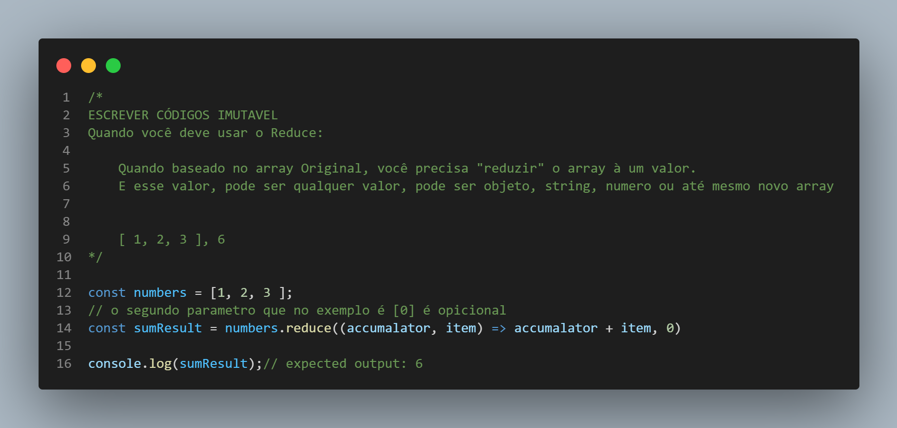

#  Quando devo usar o método map()?

Quando baseado no array Original, você precisa "reduzir" o array à um valor. E esse valor, pode ser qualquer valor, pode ser objeto, string, numero ou até mesmo novo array.

exemplo: Array Original [ 1, 2, 3 ] quero que me retorne o valor da soma dos números do array.

Usando como exemplo o array acima, o retorno vai ser 6.

O método reduce() executa uma função reducer (fornecida por você) para cada elemento do array, resultando num único valor de retorno.

O método reduce() executa a função de callback uma vez para cada elemento presente no array, excluindo furos (valores indefinidos), recebendo quatro argumentos:
1. acumulador - valor inicial (ou o valor do callback anterior),
2. valorAtual - o valor do elemento atual,
3. index - o índice atual.
4. array - o array onde a iteração está ocorrendo.


## Exercício do método reduce();
```
/*
  Exercício
  - Exiba no console uma lista dos nomes dos jogos do array abaixo;
  - A lista deve ter a formatação exemplificada abaixo do array, considerando 
    inclusive o traço e o espaço antes de cada nome.
  
  Dica: para quebrar linha, você pode usar dentro da string o caractere 
  especial \n.
*/

const cart = [
  { name: 'Dark Souls III', price: 95.03 },
  { name: 'Shadow of the Tomb Raider', price: 101.19 },
  { name: 'Sekiro: Shadows Die Twice', price: 179.99 },
  { name: 'Resident Evil 2', price: 119.90 },
  { name: 'Death Stranding', price: 149.99 }
]

/*
- Nome 1
- Nome 2
- Nome 3
*/
```

## 
<p align="center">

</p>


<h1 align="center">💻 Desenvolvido Por: Gilberto Júnior</h1>